# Форма Бэкуса-Наура календаря

календарь = событие ";" календарь | событие

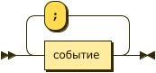

событие = дата ":" время описание

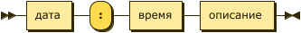

дата = день месяц год

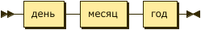

день = цифра цифра

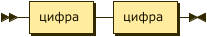

месяц = "января" | "февраля" | "марта" | "апреля" | "мая" |
"июня" | "июля" | "августа" | "сентября" | "октября" | "ноября" |
"декабря"

год = цифра цифра цифра цифра

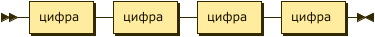

время = час ":" минута

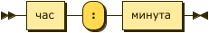

час = цифра цифра

минута = цифра цифра

описание = текст

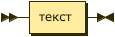

цифра = "0" | "1" | "2" | "3" | "4" | "5" | "6" | "7" | "8" | "9"

текст = [буква | цифра]...[буква | цифра]

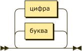

буква = "А" | "Б" | "В" | ... | "Я" | "а" | "б" | "в" | ... | "я" | "a" | "b" | "c" | ... | "z"

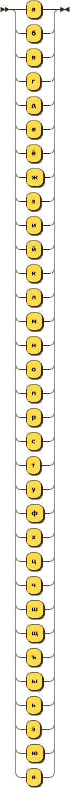

# Примеры программ

## Программа 1

    07 мая 2023: 14:20 обед

### Результат работы синтаксического анализатора:

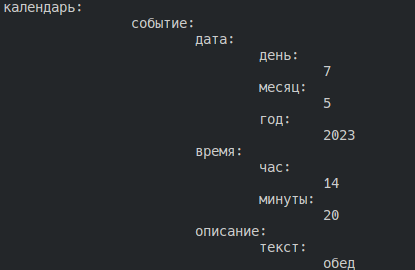

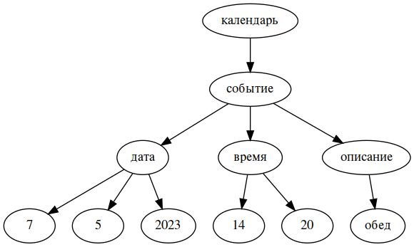

## Программа 2

    14 марта 2023: 01:59 День числа Пи;
    01 января 2023: 00:00 Новый Год;
    02 мая 2023: 18:00 Семинар

### Результат работы синтаксического анализатора:

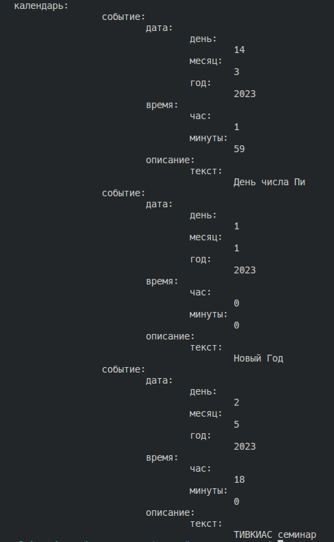

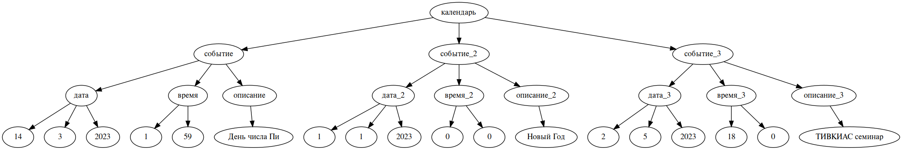

## Программа 3

        02 мая 2023: 14:20 Лекция;
        09 мая 2023: 10:00 Парад победы    

### Результат работы синтаксического анализатора:

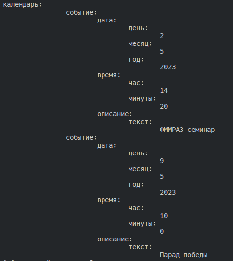

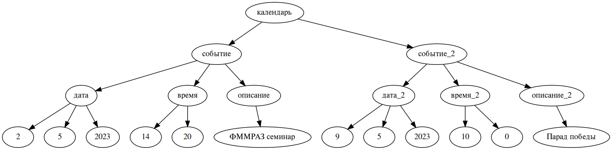